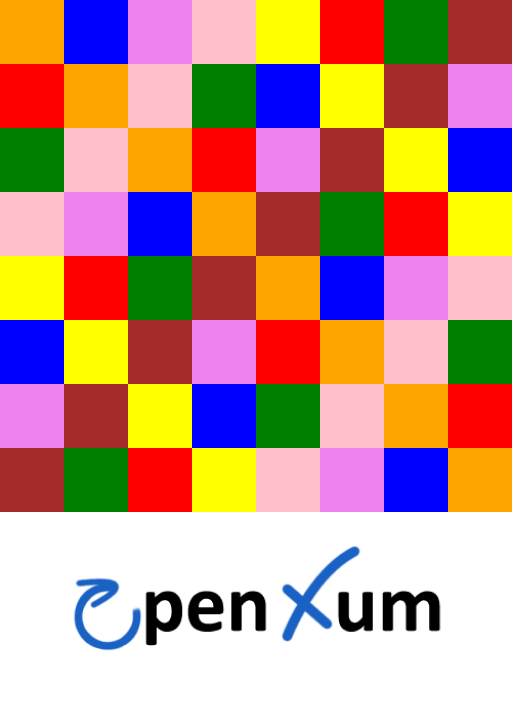

<p align="center">
    
</p>
<h1 align="center">Openxum - Kamisado</h1>
<h2 align="center">IA Adaptative - M1 WedSci</h2>
<p align="center">HEBAN Simon & SILVAIN Ludwig</p>
<p align="center"><a href="https://gitlab.com/openxum/openxum-ws-cplusplus">Dépôt original de Eric Ramat</a></p>

## Compilation

```
   git https://github.com/silvainlud/Kamisado.git
   cd Kamisado
   make download
   mkdir build
   cd build
   cmake ..
   make
```

## Utilisation

### Trouver la valeur de Lambda  

./app/src/find-lambda `whiteLevel` `blackLevel` `partyNumber`
- `partyNumber` : Nombre de parties
- `startLevel` : Niveau des blancs
- `startLevel` : Niveau des noires

### Adaptation du niveau à l'aide d'une valeur Lambda

./app/src/lambda `startLevel` `targetLevel` `partyNumber`
- `partyNumber` : Nombre de parties
- `startLevel` : Niveau de départ
- `targetLevel` : Niveau cible
- 
### Adaptation du niveau à l'aide d'une IA

./app/src/ia `startLevel` `targetLevel` `partyNumber` `modelFile`
- `partyNumber` : Nombre de parties
- `startLevel` : Niveau de départ
- `targetLevel` : Niveau cible
- `modelFile` : chemin vers le modèle (ex : `../../../model_white.pt`)

## Traitement des résultats

- `analyze_delta.py` : Analyse des résultats du programme `./find-lambda` afin de trouver la valeur de Lambda
- `analyze_party.py` : Analyse des résultats des programmes `./lambda` et `./ia`, affiche un graphique avec le nombre de changements par partie, que le niveau cible et le niveau de l'IA adaptative. Un graphique type "camembert" est aussi généré, permettant de voire le nombre de parties gagnées et perdues
